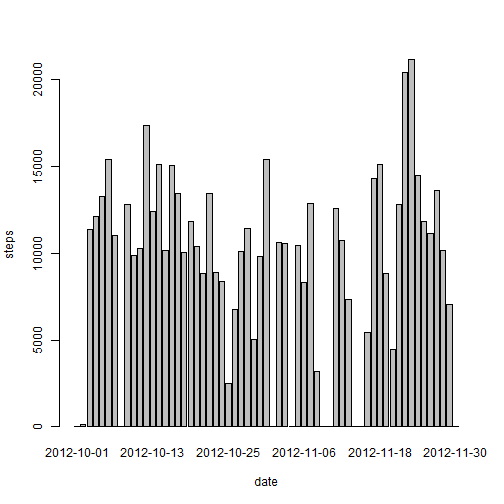

## Submission for Reproducible data for assignment1

```r
unzip("repdata-data-activity.zip")
input <- read.csv("activity.csv")
```

## What is mean total number of steps taken per day?

1. Make a histogram of the total number of steps taken each day


```r
total.steps.per.day <- aggregate(input$steps, by = list(input$date), FUN = sum, 
    na.rm = T)
barplot(total.steps.per.day$x, names.arg = total.steps.per.day$Group.1, xlab = "date", 
    ylab = "steps")
```

 


2. Calculate and report the Mean and Median for total number of
   steps taken per day


```r
mean.steps.per.day <- mean(total.steps.per.day$x, na.rm = T)
print(mean.steps.per.day)
```

```
## [1] 9354
```

```r
median.steps.per.day <- median(total.steps.per.day$x, na.rm = T)
print(median.steps.per.day)
```

```
## [1] 10395
```


## What is the average daily activity pattern?

1. Make a time series plot (i.e. `type = "l"`) of the 5-minute
   interval (x-axis) and the average number of steps taken, averaged
   across all days (y-axis)


```r
steps.interval <- aggregate(steps ~ interval, data = input, FUN = mean, na.rm = T)
plot(steps.interval, type = "l")
```

 


2. Which 5-minute interval, on average across all the days in the
   dataset, contains the maximum number of steps?


```r
steps.interval$interval[which.max(steps.interval$steps)]
```

```
## [1] 835
```

## Imputing missing values

1. Calculate and report the total number of missing values in the
   dataset (i.e. the total number of rows with `NA`s)


```r
sum(is.na(input))
```

```
## [1] 2304
```

2. Devise a strategy for filling in all of the missing values in the
   dataset. The strategy does not need to be sophisticated. For
   example, you could use the mean/median for that day, or the mean
   for that 5-minute interval, etc.

I will use the Mean value for the 5 minute intervals as fillers for missing
values.

3. Create a new dataset that is equal to the original dataset but with
   the missing data filled in.


```r
input <- merge(input, steps.interval, by = "interval", suffixes = c("", ".y"))
nas <- is.na(input$steps)
input$steps[nas] <- input$steps.y[nas]
input <- input[, c(1:3)]
```

4. Make a histogram of the total number of steps taken each day and
   Calculate and report the **mean** and **median** total number of
   steps taken per day. Do these values differ from the estimates from
   the first part of the assignment? What is the impact of imputing
   missing data on the estimates of the total daily number of steps?


```r
steps.date <- aggregate(steps ~ date, data = input, FUN = sum)
barplot(steps.date$steps, names.arg = steps.date$date, xlab = "date", ylab = "steps")
```

 

```r
mean(steps.date$steps)
```

```
## [1] 10766
```

```r
median(steps.date$steps)
```

```
## [1] 10766
```

Mean became equal to median with this imputation. 
## Are there differences in activity patterns between weekdays and weekends?

1. Create a new factor variable in the dataset with two levels --
   "weekday" and "weekend" indicating whether a given date is a
   weekday or weekend day.


```r
daytype <- function(date) {
    if (weekdays(as.Date(date)) %in% c("Saturday", "Sunday")) {
        "weekend"
    } else {
        "weekday"
    }
}
input$daytype <- as.factor(sapply(input$date, daytype))
```

2. Make a panel plot containing a time series plot (i.e. `type = "l"`)
   of the 5-minute interval (x-axis) and the average number of steps
   taken, averaged across all weekday days or weekend days
   (y-axis).


```r
par(mfrow = c(2, 1))
for (type in c("weekend", "weekday")) {
    steps.type <- aggregate(steps ~ interval, data = input, subset = input$daytype == 
        type, FUN = mean)
    plot(steps.type, type = "l", main = type)
}
```

 

